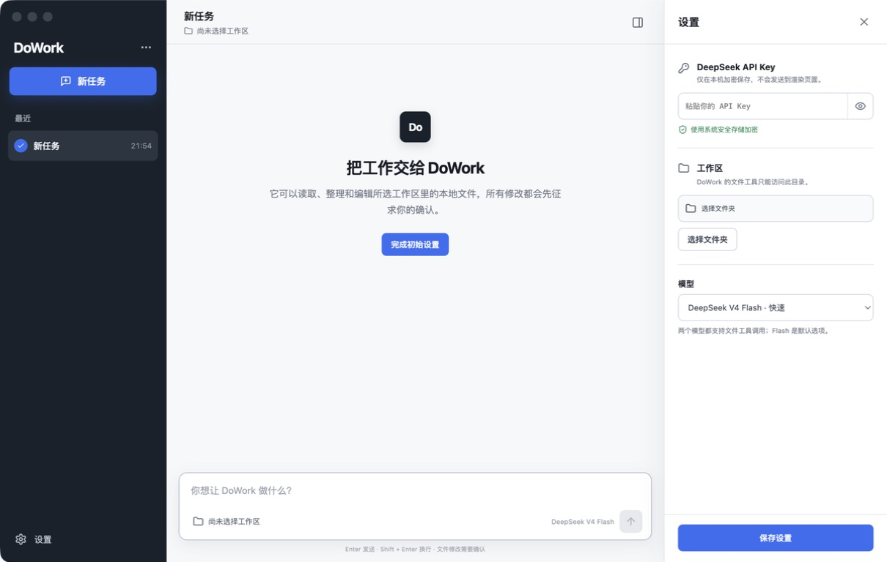

# DoWork

> 把本地文件、网页研究和重复信息任务交给桌面 Agent。

[](LICENSE)

DoWork 是一个基于 Electron、Vite 和 TypeScript 的开源桌面 AI 助手。它使用 pi agent runtime 驱动 DeepSeek，在你授权的工作区内读取和修改文件，也能搜索资讯、深度阅读网页、分析图片与 PDF、保存长期记忆，以及按计划生成新闻摘要。


## 你可以用它做什么

- 用自然语言查看、创建、修改或删除工作区文件
- 在对话框右下角切换 DeepSeek V4 Flash / V4 Pro
- 搜索中英文网页与实时新闻，并抓取正文后总结
- 上传 PNG、JPG、GIF、WebP 或 PDF 进行描述与 OCR
- 将长期偏好和项目结论保存到工作区记忆
- 创建小时、每日或每周资讯任务并输出报告
- 在写入、删除和敏感文件读取前进行明确确认

## 快速启动

### 1. 准备环境

- Node.js 22.19 或更新版本
- 一个可用的 DeepSeek API Key

### 2. 下载并运行

```bash
git clone https://github.com/lansedetange/DoWork.git
cd DoWork
npm install
npm run dev
```

### 3. 完成首次设置

启动后打开左下角的“设置”：

1. 在“模型”中填写 DeepSeek API Key。
2. 在“智能体”中选择允许 DoWork 操作的本地工作区。
3. 选择 DeepSeek V4 Flash（默认、更快）或 V4 Pro。
4. 返回对话，新建任务并直接描述你的目标。



API Key 会通过 Electron `safeStorage` 加密保存在本机，渲染进程无法读取明文。也可以在启动前通过环境变量提供：

```bash
export DEEPSEEK_API_KEY="your-deepseek-api-key"
npm run dev
```

不要把真实密钥写入源码、提交到 Git，或粘贴到对话和附件中。

## 如何使用

在输入框中直接描述需要完成的任务，例如：

```text
帮我查看这个项目的目录结构，并总结主要模块。
修改 README，补充开发环境和构建说明。
搜索今天的 AI 新闻，读取前三篇原文并生成中文摘要。
分析这张产品截图，提取其中的文字和主要界面元素。
每天上午 9 点搜索 Electron 最新动态并写入资讯报告。
记住这个项目默认使用 TypeScript 严格模式。
```

使用时需要了解：

- 文件操作始终限制在选定工作区内，路径穿越和符号链接逃逸会被阻止。
- 普通文件可直接读取；敏感文件、写入、修改和删除会要求确认。
- 点击输入框左下角的附件按钮可添加文本、图片或 PDF。
- 图片与 PDF 需要配置 Gemini；没有配置时，普通文本与文件能力仍可使用。
- 长期记忆、定时任务、报告和日志保存在工作区的 `.dowork/` 目录。
- 定时任务由 DoWork 进程执行，应用完全退出后不会继续运行。

## 可选的外部能力

Google News RSS、Hacker News API 和 Bing RSS 无需额外密钥。下列服务按需配置，所有凭据只从环境变量读取：

```bash
# 增加 NewsAPI 新闻源及本地日调用上限
export NEWSAPI_API_KEY="your-newsapi-key"
export NEWSAPI_DAILY_LIMIT="50"

# 图片、OCR 与 PDF 理解
export GEMINI_API_KEY="your-gemini-api-key"
export GEMINI_VISION_MODEL="gemini-3.7-flash"
export GEMINI_DAILY_LIMIT="50"

# 网页正文抽取回退服务
export JINA_API_KEY="your-jina-api-key"
export JINA_DAILY_LIMIT="100"
```

## 开发命令

```bash
npm run dev        # 启动开发模式
npm run typecheck  # TypeScript 类型检查
npm test           # 运行测试
npm run build      # 生成生产构建到 out/
npm run preview    # 预览生产构建
```

主要技术栈：Electron、React、Vite、TypeScript、pi agent runtime 和 DeepSeek OpenAI-compatible API。

## 安全边界

- `contextIsolation`、sandboxed preload 与 Content Security Policy
- API Key 使用 Electron `safeStorage` 本地加密
- 工作区路径隔离与符号链接逃逸防护
- `.env`、`.ssh/`、私钥和凭据文件的敏感路径识别
- 附件、记忆、会话与调度日志的密钥检测和输出脱敏
- 公网网页抓取会拒绝本机、局域网和内网地址

DoWork 目前不会执行任意 shell 命令，也不会在未确认时修改工作区文件。

## License

本项目采用 [MIT License](LICENSE)。
